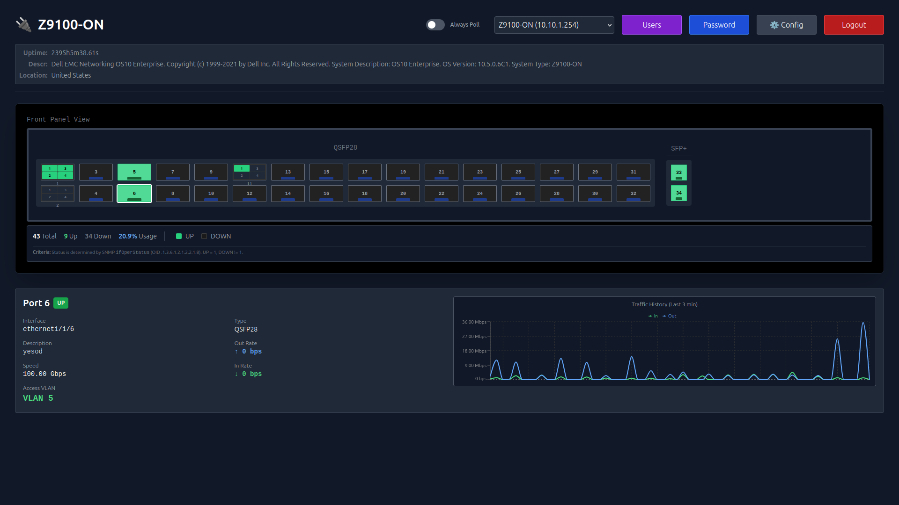

# Network Device Visualizer

Network Device Visualizer is a comprehensive web-based tool designed to provide real-time visibility into network infrastructure. It leverages SNMP to poll network devices (such as switches and routers), retrieving critical information like port status, traffic statistics, and VLAN configurations. The application presents this data in an intuitive, interactive graphical interface, allowing network administrators to quickly assess device health and connectivity.



## Project Structure

The project follows a standard Go project layout:

-   `cmd/server`: Contains the main entry point for the application.
-   `internal`: Private application code.
    -   `auth`: JWT authentication and password management.
    -   `db`: SQLite database interactions and schema management.
    -   `handlers`: HTTP API handlers and middleware.
    -   `models`: Data structures used throughout the application.
    -   `snmp`: SNMP polling logic and data processing.
-   `web`: React frontend application (built with Vite).
-   `schema.sql`: Database schema definition.
-   `docker-compose.yaml`: Docker deployment configuration.

## Features

-   **Device Visualization**: Interactive visualization of device ports and status.
-   **VLAN Detection**: Automatic detection of VLANs (Access, Trunk, Native) via SNMP.
-   **Secure Authentication**: JWT-based authentication with secure password policies.
-   **HTTPS Support**: Automatic self-signed certificate generation and HTTP-to-HTTPS redirection.
-   **Docker Ready**: Easy deployment using Docker Compose.

## Getting Started

### Prerequisites

-   Docker & Docker Compose

### Deployment (Recommended)

1.  **Clone the repository**:
    ```bash
    git clone https://github.com/nullpo7z/nwdevice-visualizer.git
    cd nwdevice-visualizer
    ```

2.  **Configure Environment**:
    Edit `docker-compose.yaml` and set a secure `JWT_SECRET`.
    ```yaml
    environment:
      - JWT_SECRET=your_secure_random_secret_here
    ```

3.  **Start the Application**:
    ```bash
    docker-compose up -d
    ```

4.  **Access**:
    Open `https://{ipaddress}:8443` in your browser. Accept the self-signed certificate warning (for local testing).

## Configuration

The application can be configured via environment variables:

| Variable | Description | Default |
| :--- | :--- | :--- |
| `PORT` | Internal server port | `8080` |
| `DB_PATH` | Path to SQLite database | `./switches.db` |
| `JWT_SECRET` | Secret key for JWT signing | `my_secret_key` (Change this!) |
| `CERT_FILE` | Path to TLS certificate | `server.crt` |
| `KEY_FILE` | Path to TLS private key | `server.key` |

## Usage

1.  **Login**:
    -   Default credentials are `admin` / `admin`.
    -   You will be prompted to change your password upon first login.

2.  **Add Device**:
    -   Click "Add New Device".
    -   Enter the **IP Address** and **SNMP Community String** (default: `public`).
    -   (Optional) Enter a **Name** or let it auto-detect from the device hostname.

3.  **Visualize**:
    -   Select a device from the list.
    -   View real-time port status (Up/Down), traffic usage, and VLAN details.
    -   Click on a port to see detailed statistics (Speed, In/Out Rate).

4.  **Edit Config**:
    -   Click the "Edit" button on a device card to open the configuration modal.
    -   **Device Details**: Update the name, community string, or toggle polling status.
    -   **Port Layout**: Customize the visual representation of ports. You can add sections, set port types (RJ45, SFP, etc.), define port ranges (e.g., `1-24`), and choose layout styles.

5.  **User Management**:
    -   Admins can manage users via the "Users" button in the header.

